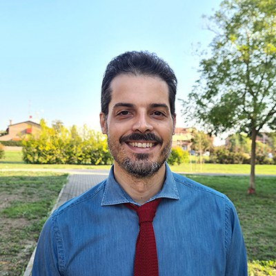

My name is Mauro Tortonesi and I am an Associate Professor at the Department of
Mathematics and Computer Science of the University of Ferrara, Italy. I teach
[Computer
Networks](https://www.unife.it/ing/informazione/reti-calcolatori/scheda-insegnamento/en),
[Industrial Internet of
Things](http://www.unife.it/ing/lm.infoauto/industrial-iot/scheda-insegnamento/en),
and [Cloud and Mobile
Computing](http://www.unife.it/ing/lm.infoauto/cloud-mobile-computing/scheda-insegnamento/en).
My research interests include Big Data in Industry 4.0, Fog and Cloud
Computing, middleware solutions to support communications in constrained
environments, and smart water metering. For more information about my research
work, please refer to [this page](https://ds.unife.it/people/mauro.tortonesi/).

